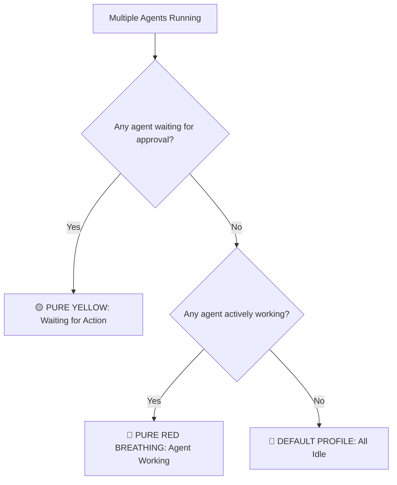

# ⚡ ASUS Laptop — AI Keyboard RGB Sync

<div align="center">


**An ultra-lightweight Windows background daemon that synchronizes your ASUS gaming laptop's built-in RGB keyboard backlight with the real-time active states of your AI coding and chat agents.**

[Key Features](#-features) • [Lighting Modes](#-lighting-behavior) • [Quick Start](#-quick-start) • [How It Works](#-how-it-works) • [Configuration](#-configuration)

</div>

---

## 🌟 Overview

When working with autonomous AI agents like **Antigravity** and **Claude Desktop**, you frequently wait for them to generate complex code, execute terminal commands, or request approval.

Instead of constantly alt-tabbing or monitoring windows, **ASUS TUF AI RGB Sync** turns your laptop's built-in keyboard backlight into a living, physical ambient status indicator:
- **Red breathing pulses** let you know your agent is hard at work across the room.
- **Solid vibrant yellow** immediately alerts you when the agent needs your confirmation or input.
- **Instant reversion** to your calm custom profile the moment work completes.

---

## 🎨 Lighting Behavior

| State | Backlight Mode | Color | Trigger Event |
|:---|:---:|:---:|:---|
| **🔴 Agent Working** | **Breathing** | **Pure Red** `(255, 0, 0)` | Agent actively thinking, generating tokens, running shell commands, or executing tool chains. |
| **🟡 Waiting for Action** | **Solid** | **Pure Yellow** `(255, 255, 0)` | Agent awaiting user approval (plan review, tool confirmation, question modal). |
| **🔵 Idle / Done / Normal** | **Solid** | **Default Profile** `(0, 220, 255)` | Agents are open but idle or waiting for your next prompt. |
| **💤 Dormant Mode** | **Solid** | **Default Profile** | Both Antigravity and Claude Desktop are closed; daemon sleeps with ~0% CPU. |

### ⚡ State Priority Hierarchy
When both Antigravity and Claude Desktop are running simultaneously, state priority ensures you never miss an urgent prompt:



$$\mathbf{Waiting\ for\ Approval\ (Yellow)} \succ \mathbf{Working\ (Red\ Breathing)} \succ \mathbf{Idle\ (Default\ Profile)}$$

---

## 🚀 Quick Start

### Prerequisites
- **ASUS Gaming Laptop** (compatible with TUF and ROG models supporting ASUS ACPI keyboard backlight control).
- **Windows 10 / 11**.
- **Python 3.10+** (standard Windows installation).

### 1. Start Silently in Background
Double-click:
```bat
start.bat
```
The daemon will quietly minimize to your system tray with zero popup windows.

### 2. Auto-Start with Windows
To automatically start every time you boot Windows:
- Double-click **`setup_autostart.bat`**, OR
- Right-click the system tray icon and check **`Start with Windows`**.

### 3. Stop / Reset
Double-click:
```bat
stop.bat
```
Terminates the daemon and immediately restores your default keyboard backlight profile.

---

## 🖥️ System Tray Interface

The application includes a native Win32 system tray icon requiring zero external GUI libraries:

<div align="center">

```
+---------------------------------------------+
| Status: WORKING (AG: WORKING, Claude: IDLE) |
|---------------------------------------------|
| Test: Pure 255 Red (Working)                |
| Test: Pure 255 Yellow (Waiting)             |
| Test: Default Profile (Idle)                |
|---------------------------------------------|
| [✓] Start with Windows                      |
| Open Settings (config.json)                 |
|---------------------------------------------|
| Exit                                        |
+---------------------------------------------+
```

</div>

- **Real-time Tooltip**: Hover over the tray icon at any moment to see live status of each AI agent.
- **Manual Light Tests**: Instantly trigger each light state to test your keyboard hardware.
- **Double-click Tray Icon**: Quickly opens `config.json` in Notepad.

---

## 🛠️ How It Works

```
                       +-------------------------------+
                       |    Smart System Tray Daemon   |
                       | (Native Win32 ShellNotifyIcon)|
                       +---------------+---------------+
                                       |
                     +-----------------+-----------------+
                     v                                   v
      +-------------------------------+   +-------------------------------+
      |      Antigravity Monitor      |   |     Claude Desktop Monitor    |
      | - Watches active conversation |   | - Monitors process CPU delta  |
      |   transcript.jsonl in real-time|   | - Tracks LevelDB writes       |
      | - Tracks tool approvals & turns|  | - Detects chat streaming rate  |
      +---------------+---------------+   +---------------+---------------+
                      |                                   |
                      +----------------+------------------+
                                       |
                                       v
                       +-------------------------------+
                       |   Priority & State Resolver   |
                       +---------------+---------------+
                                       |
                                       v
                       +-------------------------------+
                       |     ASUS TUF ACPI Driver      |
                       |  DeviceIoControl(\\.\ATKACPI) |
                       | Device 0x00100056 (TUF_KB)   |
                       +---------------+---------------+
                                       |
                                       v
                       +-------------------------------+
                       |  💻 Built-in RGB Backlight    |
                       +-------------------------------+
```

### Direct Kernel ACPI Control
Unlike conventional tools that rely on bulky SDKs or heavyweight background suites, this utility communicates directly with the motherboard embedded controller via the Windows kernel ACPI device:
- **Device Handle**: `\\.\ATKACPI` (IoControlCode `0x0022240C`).
- **Device IDs**: `0x00100056` (`TUF_KB`) and fallback `0x0010005a` (`TUF_KB2`).
- **State Caching**: Only writes to ACPI upon actual state transitions, preventing bus flooding.

### Resource Efficiency
- **RAM**: ~10–14 MB total memory footprint.
- **CPU**: < 0.05% CPU during active tracking, ~0.00% CPU when dormant.
- **Pure Python**: Zero heavy GUI frameworks (no Qt, Electron, or Node.js).

---

## ⚙️ Configuration (`config.json`)

All colors, modes, speeds, and polling intervals can be customized in `config.json`:

```json
{
    "colors": {
        "working": {
            "mode": 1,
            "rgb": [255, 0, 0],
            "speed": 1
        },
        "waiting_approval": {
            "mode": 0,
            "rgb": [255, 255, 0],
            "speed": 1
        },
        "default_idle": {
            "mode": 0,
            "rgb": [0, 220, 255],
            "speed": 1
        }
    },
    "timings": {
        "active_poll_interval_sec": 0.35,
        "dormant_poll_interval_sec": 2.5
    },
    "priority": "waiting_first",
    "autostart": false
}
```

### Mode Reference
| Code | Effect |
|:---:|:---|
| `0` | Static Solid |
| `1` | Breathing |
| `2` | Color Cycle |
| `10` | Strobing |

### Speed Reference
| Code | Speed |
|:---:|:---|
| `0` | Slow |
| `1` | Normal |
| `2` | Fast |

---

## 📂 Repository Structure

```
Keyboard_lights_Sync/
├── main.py                 # Daemon entry point & signal orchestration
├── coordinator.py          # Multi-agent state resolver & priority engine
├── tuf_lighting.py         # ASUS ATKACPI kernel keyboard hardware driver
├── antigravity_monitor.py  # Antigravity real-time transcript & approval monitor
├── claude_monitor.py       # Claude Desktop streaming & chat monitor
├── tray_app.py             # Native Win32 system tray icon & menu
├── autostart.py            # Windows Startup folder integration
├── config.py               # Settings loader & default fallbacks
├── config.json             # User-configurable colors and timings
├── start.bat               # Silent background launcher
├── start_hidden.vbs        # VBScript runner for pythonw.exe (no CMD window)
├── stop.bat                # Graceful shutdown & backlight restore script
├── setup_autostart.bat     # One-click Windows startup toggle
└── README.md               # Documentation
```

---

## 📄 License

MIT License © 2026
